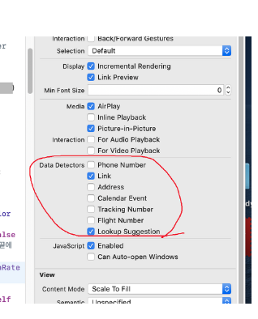

WKWebVeiw 를 띄워서 스토어 페이지르 띄우고 있다.
2022.06.16 과 같은 날짜 타입이나 AF02 와 같은 항공권고 비슷한 형태의 문자열이 보여질 때 화면이 깨지거나 누르면 달력으로 이동되는 등 이벤트 처리가 자동으로 되었다.
날짜를 보여주기만 하는 페이지인데 날짜르 누르면 달력으로 이동된다던지 이벤트 팝업이 발생하여서 사용하는데 불편하였다.
**종찬**님의 공유로 dataDetectorTypes 이라는 설정이 WKWebViewConfiguration 에 존재하는 것을 발견하였다.
1. 스토리보드에 WKWebView 의 Attribute Inspector 에서 안보이게 할 데이터 타입의 체크 박스르 해제하여 해결할 수 있다.

2. let configuration = WKWebViewConfiguration()
   configuration.dataDetectorTypes = []
   
Config 객체를 만들어서 dataDetectorTypes 에 빈 배열을 넣어서 모든 데이터 타입을 감지하지 않도록 할 수 있다.

참고 :
https://developer.apple.com/documentation/webkit/wkwebviewconfiguration/1641937-datadetectortypes
